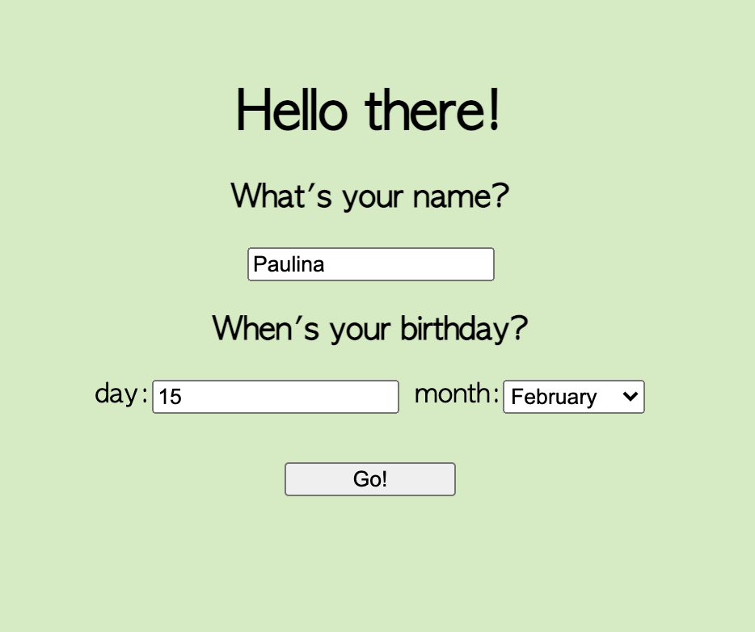

## Birthday App
The challenge was to build a web app that will ask the user for a name and birthday.

When the user submits the form, and depending on the current date, the app either:

- wishes the user happy birthday
- tells them how long they'll have to wait until their next birthday

### Quickstart
1. Fork this repository
2. `git clone git@github.com:paulinakoz/birthday-app.git`
3. `cd birthday-app`
4. `npm install` to install project dependencies
5. `npm run dev` to run the server

### Running tests
```sh
npm test 
#and
npx cypress open
```

### What it looks like

<br/>

<br/>

<br/>
